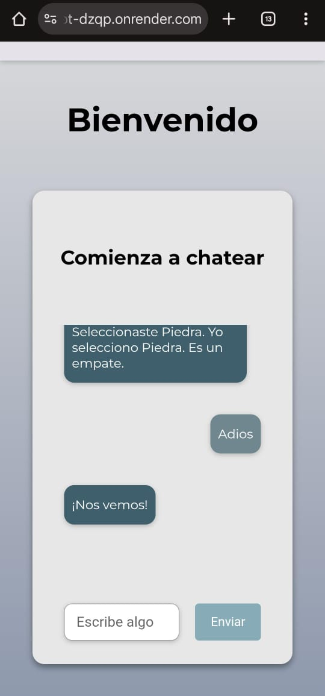
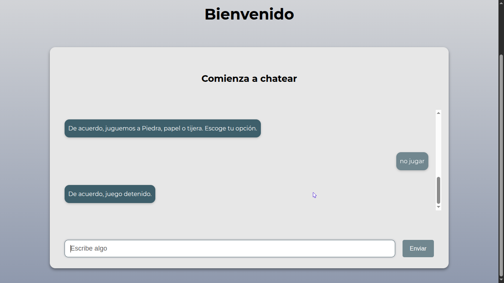
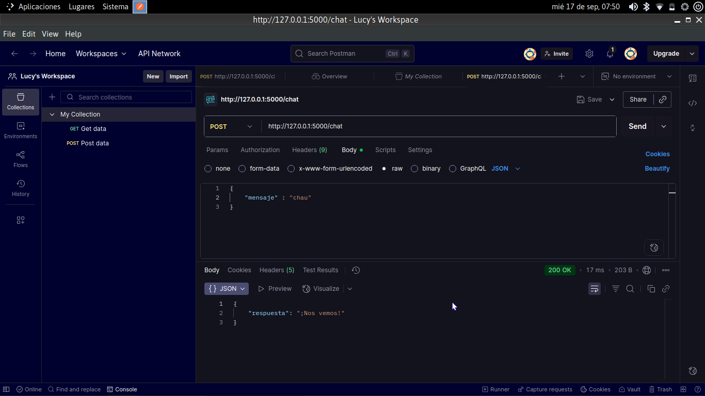

# ChatBot Web App

Una aplicación web de chatbot interactivo desarrollada con **Python**, **Flask**, **HTML/CSS** y **JavaScript**. Este proyecto es mi primer experimento completo en desarrollo web full-stack y sirve como demostración de mi capacidad para integrar **frontend** y **backend**, manejar solicitudes HTTP, y trabajar con APIs internas.

---

## Funcionalidades

- Chat entre usuario y bot.
- El bot puede saludar, jugar Piedra, Papel y Tijera y despedirse.
- Respuesta automática del bot.
- Interfaz responsiva que funciona en escritorio y móvil.
- Entrada de usuario y envío por botón o tecla Enter.

---

## Tecnologías usadas

- **Backend:** Python 3.11, Flask
- **Frontend:** HTML5, CSS3, JavaScript
- **Deploy:** Render
- **Control de versiones:** Git / GitHub

---

## Instalación (local)

1. Clonar el repositorio:  
   ```bash
   git clone https://github.com/lucyAnz01/ChatBot.git
   cd ChatBot

2. Crear un entorno virtual
   python -m venv myvenv
   source myvenv/bin/activate # Linux/macOS
   venv\Scripts\activate     # Windows

3. Instalar dependencias 
   pip install -r requirements.txt

4. Ejecutar 
   python chatbot_api.py

5. Abrir navegador en:
   http://127.0.0.1:5000/
   
## Uso

1.Ingresa tu mensaje en la entrada de texto.
2.Presiona enter o botón de enviar.
3.Mira la respuesta del bot en la ventana del chat.

## Despliegue en Vivo

[Ver ChatBot](https://chatbot-dzqp.onrender.com)




## Notas sobre el proyecto

- Proyecto inicial de portafolio, principalmente de aprendizaje y experimentación.
- Practiqué la integración de JavaScript con Flask y manejo de rutas POST/GET y endpoints.
- Experiencia en deploy de aplicaciones a Render.
- Aprendí a manejar static y templates correctamente.

## Pruebas en Postman



## Contribuciones

Este proyecto es principalmente de aprendizaje. Si deseas colaborar, contactame.

## Autor 

[LucyAnz](https://github.com/lucyanz01)
